<h1> Attention-Enhanced Future Frame Prediction with Feature Discrepancy Scoring for Video Anomaly Detection </h1>
<h2>Abstract</h2>

Video anomaly detection in surveillance environments is challenging due to the scarcity of abnormal events,
lack of frame-level annotations, and the subtle nature of behaviors such as theft.
Prediction-based approaches address this problem by learning normal spatio-temporal patterns through
future-frame prediction and detecting anomalies as deviations between predicted and actual frames.
However, most existing methods rely heavily on pixel-level prediction errors, which are sensitive to noise
and often fail to capture localized and subtle abnormal activities.

To address these limitations, we propose an <b>attention-enhanced future-frame prediction framework</b>
for unsupervised video anomaly detection.
The proposed model integrates a spatio-temporal attention mechanism into a CNN–ConvLSTM–decoder
architecture, enabling the network to focus on behavior-relevant regions and critical temporal segments.
In addition, anomaly scoring is performed using a combination of pixel-level and feature-level discrepancies,
resulting in improved robustness to noise and enhanced sensitivity to subtle theft-like behaviors.
The model is trained solely on normal data and does not require explicit anomaly annotations.

<h2>Additional / Unique Features Added</h2>

<h3>1. Spatio-Temporal Attention Mechanism</h3>

Most prediction-based anomaly detection models treat all spatial regions and temporal frames equally.
In practice, abnormal behaviors such as theft are localized (e.g., hand–object interactions) and occur
over short time intervals.

The proposed spatio-temporal attention module assigns higher importance to:

<ul>
  <li>Regions with significant motion or interaction</li>
  <li>Temporal segments where behavior changes abruptly</li>
</ul>

By suppressing static background regions and emphasizing behavior-relevant areas,
the attention mechanism enables the model to concentrate its predictive capacity where anomalies are
most likely to occur.

<h3>2. Feature-Level Anomaly Scoring</h3>

Existing methods primarily rely on pixel-level metrics (e.g., PSNR or MSE) to compute anomaly scores.
Such metrics are sensitive to illumination changes, camera noise, and minor background variations.

To overcome this limitation, the proposed framework introduces feature-level discrepancy by comparing
deep representations of predicted and actual frames.
These representations encode semantic and motion information, making them more robust to noise.

The final anomaly score is computed by combining:

<ul>
  <li>Pixel-level prediction error (captures large deviations)</li>
  <li>Feature-level discrepancy (captures subtle behavioral changes)</li>
</ul>

<h2>Effect of the Added Features</h2>

<ul>
  <li><b>Improved Sensitivity to Subtle Anomalies:</b>
      Attention highlights small but meaningful motion patterns that pixel-level errors may overlook.</li>

  <li><b>Reduced False Positives:</b>
      Background motion and illumination changes are downweighted, leading to fewer spurious detections.</li>

  <li><b>Better Behavioral Modeling:</b>
      Feature-level comparison captures semantic inconsistencies rather than raw pixel noise.</li>

  <li><b>Lightweight Design:</b>
      The added modules introduce minimal computational overhead compared to memory banks or diffusion models.</li>
</ul>

<h2>Architecture Explanation</h2>

<h3>Overall Pipeline</h3>
<pre>
Input Past Frames
      ↓
CNN Encoder
      ↓
ConvLSTM
      ↓
Spatio-Temporal Attention
      ↓
Decoder (Future Frame Prediction)
      ↓
Pixel-Level + Feature-Level Comparison
      ↓
Anomaly Score
</pre>

<h3>Component-wise Description</h3>

<h4>CNN Encoder</h4>

The CNN encoder processes each input frame independently and extracts spatial features such as edges,
object shapes, and local motion cues.
This step transforms raw pixel input into a compact and semantically meaningful representation.

<h4>ConvLSTM</h4>

ConvLSTM layers model the temporal evolution of spatial features across consecutive frames.
They learn normal motion dynamics and interaction patterns present in surveillance scenes.
Abnormal events disrupt these learned temporal regularities.

<h4>Spatio-Temporal Attention Module</h4>

The attention module operates on ConvLSTM feature maps and assigns adaptive weights across spatial
and temporal dimensions.
Regions and frames contributing more to behavioral changes receive higher weights,
guiding the decoder toward important motion patterns.

<h4>Decoder</h4>

The decoder reconstructs the predicted future frame using attended spatio-temporal features.
Accurate prediction indicates normal behavior, while poor prediction indicates abnormal activity.

<h4>Anomaly Scoring</h4>

During inference, the predicted frame is compared with the actual frame at both pixel and feature levels.
The combined discrepancy serves as the anomaly score, with higher values indicating abnormal events.

<h2>Literature Survey</h2>

<table border="1" cellpadding="8" cellspacing="0" width="100%">
  <tr>
    <th>Sl No</th>
    <th>Title</th>
    <th>Author & Year</th>
    <th>Objectives</th>
    <th>Datasets</th>
    <th>Algorithms Used / Techniques</th>
    <th>Description</th>
    <th>Results</th>
    <th>Limitations</th>
  </tr>

  <tr>
    <td>1</td>
    <td>Future Frame Prediction for Anomaly Detection – A New Baseline</td>
    <td>Wen Liu et al., 2018</td>
    <td>Detect anomalies in surveillance videos by predicting future frames and identifying deviations from normal behavior</td>
    <td>UCSD Ped1, UCSD Ped2, CUHK Avenue, ShanghaiTech</td>
    <td>U-Net, GAN, Intensity loss, Gradient loss, Optical flow–based motion constraint, PSNR scoring</td>
    <td>
      U-Net predicts future frames from past frames. GAN improves visual realism of predictions.
      Intensity loss enforces pixel-level similarity. Gradient loss preserves edges and structure.
      Optical flow constraint enforces temporal motion consistency between predicted and real frames.
      PSNR measures prediction quality to compute anomaly score.
    </td>
    <td>
      Achieved AUC of 95.4% (UCSD Ped2), 84.9% (Avenue), and 72.8% (ShanghaiTech),
      outperforming reconstruction-based baselines
    </td>
    <td>
      No explicit long-term temporal modeling; relies on externally computed optical flow (high computation);
      GAN training instability; pixel-level PSNR sensitive to noise; higher false positives for subtle theft-like actions
    </td>
  </tr>

  <tr>
    <td>2</td>
    <td>Anomaly Detection Based on a 3D CNN Combining CBAM Using Merged Frames</td>
    <td>In-Chang Hwang, Hyun-Soo Kang, 2023</td>
    <td>Detect anomalous (violent) behaviors in surveillance videos using spatio-temporal feature learning</td>
    <td>UBI-Fights, RWF-2000, UCSD Ped1, UCSD Ped2</td>
    <td>3D CNN (ResNet-10/18/34/50), CBAM, merged-frame (grid frame) input, binary classification</td>
    <td>
      3D CNN captures spatial and temporal information jointly. Merged grid frames encode multiple consecutive
      frames into a single structured input to reduce memory usage and preserve temporal context.
      CBAM applies channel and spatial attention to focus on important motion regions.
    </td>
    <td>
      Achieved AUC 0.9973 (UBI-Fights), ACC 0.9920 (RWF-2000),
      AUC 0.9188 (UCSD Ped1), AUC 0.9959 (UCSD Ped2)
    </td>
    <td>
      Supervised binary classification; not suitable for unsupervised settings; focuses on violent actions;
      high computational cost due to 3D CNN; scene-specific training required
    </td>
  </tr>

  <tr>
    <td>3</td>
    <td>Spatio-temporal Prediction and Reconstruction Network for Video Anomaly Detection</td>
    <td>Ting Liu et al., 2022</td>
    <td>Improve anomaly detection accuracy by combining future-frame prediction and reconstruction</td>
    <td>UCSD Ped1, UCSD Ped2, CUHK Avenue</td>
    <td>U-Net prediction, HDC, Bidirectional ConvLSTM, Autoencoder, GAN, PSNR</td>
    <td>
      Prediction module learns future dynamics. HDC captures multi-scale spatial features.
      DB-ConvLSTM models forward and backward temporal dependencies.
      Reconstruction improves robustness; PSNR used for anomaly scoring.
    </td>
    <td>
      Achieved AUC 85.1% (Ped1), 96.6% (Ped2), 86.5% (Avenue)
    </td>
    <td>
      High model complexity; increased computational cost; reliance on PSNR;
      requires complete normal training data
    </td>
  </tr>

  <tr>
    <td>4</td>
    <td>Future Frame Prediction Network for Video Anomaly Detection</td>
    <td>Yi Zhu et al., 2019</td>
    <td>Detect anomalies by predicting future frames and identifying temporal deviations</td>
    <td>UCSD Ped1, UCSD Ped2, CUHK Avenue</td>
    <td>CNN encoder–decoder, ConvLSTM, future-frame prediction, MSE, PSNR</td>
    <td>
      CNN extracts spatial representation; ConvLSTM captures temporal dependencies.
      Future-frame prediction models normal motion evolution; PSNR derives anomaly score.
    </td>
    <td>
      AUC 83.3% (Ped1), 95.2% (Ped2), 84.1% (Avenue)
    </td>
    <td>
      Weak long-term temporal modeling; sensitive to illumination and background motion;
      relies on pixel-level PSNR
    </td>
  </tr>

  <tr>
    <td>5</td>
    <td>Anomaly Detection in Surveillance Videos via Memory-Augmented Frame Prediction</td>
    <td>Jie Liu et al., 2020</td>
    <td>Prevent over-generalization by memorizing normal patterns</td>
    <td>UCSD Ped1, UCSD Ped2, CUHK Avenue</td>
    <td>Memory-augmented ConvLSTM, external memory, PSNR</td>
    <td>
      Memory module stores normal spatio-temporal prototypes.
      ConvLSTM predicts frames conditioned on memory retrieval.
    </td>
    <td>
      AUC 86.8% (Ped1), 96.1% (Ped2), 85.7% (Avenue)
    </td>
    <td>
      Memory size sensitive to hyperparameters; higher computation;
      limited generalization; pixel-level scoring
    </td>
  </tr>

  <tr>
    <td>6</td>
    <td>Advancing Video Anomaly Detection: A Bi-Directional Hybrid Framework</td>
    <td>Guodong Shen et al., 2024</td>
    <td>Improve prediction models and integrate into multi-task frameworks</td>
    <td>UCSD Ped2, CUHK Avenue, ShanghaiTech, Street Scene</td>
    <td>Bi-directional prediction, ConvTTrans, Vision Transformer, LI-ConvLSTM</td>
    <td>
      Bi-directional middle-frame prediction improves temporal stability.
      ConvTTrans captures long-range dependencies; LI-ConvLSTM preserves spatial detail.
    </td>
    <td>
      AUC 99.3% (UCSD), 90.7% (Avenue), 82.2% (ShanghaiTech)
    </td>
    <td>
      High architectural complexity; higher computational cost;
      still relies on pixel/perceptual error
    </td>
  </tr>

  <tr>
    <td>7</td>
    <td>Video Anomaly Detection via Spatio-Temporal Pseudo-Anomaly Generation</td>
    <td>Ayush K. Rai et al., 2024</td>
    <td>Generate pseudo-anomalies to improve unsupervised detection</td>
    <td>UCSD Ped2, CUHK Avenue, ShanghaiTech, UBnormal</td>
    <td>LDM, optical-flow mixup, 3D-CNN AE, ViFi-CLIP</td>
    <td>
      Diffusion generates spatial anomalies; optical-flow mixup generates temporal anomalies;
      unified scoring aggregates multiple cues.
    </td>
    <td>
      AUC 93.5% (Ped2), 86.6% (Avenue), 71.7% (ShanghaiTech)
    </td>
    <td>
      High computational cost; not end-to-end; manual score tuning;
      struggles with complex interactions
    </td>
  </tr>

  <tr>
    <td>8</td>
    <td>Video Anomaly Detection Based on Spatio-Temporal Relationships Among Objects</td>
    <td>Yang Wang et al., 2023</td>
    <td>Model object interactions to detect anomalies</td>
    <td>UCSD Ped2, CUHK Avenue, ShanghaiTech</td>
    <td>Encoder–decoder, attention, dynamic pattern generator</td>
    <td>
      Models inter-object spatial and temporal relationships to distinguish normal
      and abnormal interactions.
    </td>
    <td>
      AUC 98.4% (UCSD Ped2)
    </td>
    <td>
      Reconstruction bias; limited semantic scoring; may miss subtle anomalies
    </td>
  </tr>

  <tr>
    <td>9</td>
    <td>Video Anomaly Detection System Using Deep Convolutional and Recurrent Models</td>
    <td>Maryam Qasim, Elena Verdu, 2023</td>
    <td>Detect criminal activities using supervised learning</td>
    <td>UCF-Crime</td>
    <td>ResNet, SRU, CNN-RNN hybrid</td>
    <td>
      CNN extracts spatial features; SRU captures temporal dependencies;
      supervised classification.
    </td>
    <td>
      91.44% accuracy, 91.64% AUC
    </td>
    <td>
      Fully supervised; limited generalization; not open-set anomaly detection
    </td>
  </tr>

  <tr>
    <td>10</td>
    <td>A Distillation Network using Improved ConvLSTM for Video Anomaly Detection</td>
    <td>Jialong Li et al., 2024</td>
    <td>Improve subtle anomaly detection using knowledge distillation</td>
    <td>ShanghaiTech, UCSD Ped2</td>
    <td>I3D teacher, MogConvLSTM, knowledge distillation</td>
    <td>
      Teacher provides semantic guidance; student improves temporal modeling
      and reduces identity mapping.
    </td>
    <td>
      AUC 74.8% (ShanghaiTech), 76.31% (UCSD Ped2)
    </td>
    <td>
      Higher inference time; increased complexity; still pixel-residual based
    </td>
  </tr>

</table>

<h1>Dataset Statistics</h1>

<table border="1" cellpadding="8" cellspacing="0" width="100%">
  <tr>
    <th>Dataset</th>
    <th>Normal Videos (Training)</th>
    <th>Abnormal Videos / Events (Testing)</th>
    <th>Testing Videos</th>
    <th>Notes</th>
  </tr>

  <tr>
    <td><b>UCSD Ped2</b></td>
    <td>16 normal videos</td>
    <td>Abnormal events embedded in test videos (vehicles, bicycles, carts, skateboards)</td>
    <td>12 mixed videos (normal + abnormal)</td>
    <td>
      Training set contains only normal behavior.
      Designed specifically for unsupervised video anomaly detection.
    </td>
  </tr>

  <tr>
    <td><b>CUHK Avenue</b></td>
    <td>16 normal videos</td>
    <td>~47 abnormal events (running, loitering, throwing objects, wrong-direction walking)</td>
    <td>21 mixed videos (normal + abnormal)</td>
    <td>
      More complex scenes and diverse anomaly types.
      Standard benchmark for evaluating robustness of anomaly detection models.
    </td>
  </tr>

  <tr>
    <td><b>ShanghaiTech Campus</b></td>
    <td>Large-scale normal data (~270,000+ frames across 13 scenes)</td>
    <td>~130 abnormal events across multiple scenes</td>
    <td>Mixed test set (normal + abnormal frames)</td>
    <td>
      Large and diverse dataset with multiple camera views.
      Frame-level ground truth annotations available for evaluation.
    </td>
  </tr>
</table>

<h1> Detailed Description </h1>
<h2>1. What is your project about? (Big Picture)</h2>

Your project is about video anomaly detection in surveillance videos, with a specific interest in subtle behaviors like theft.

In simple terms:

You want a system that learns what normal behavior looks like in a surveillance scene and raises an alert when something unexpected or abnormal (like theft) happens — without needing labeled anomaly data.

<h2>2. Why is this problem hard?</h2>

From your literature survey, the main challenges are:

<ul>
  <li><b>Anomalies are rare</b>
    <ul>
      <li>You don’t have enough theft videos to train supervised models.</li>
    </ul>
  </li>

  <li><b>Theft is subtle</b>
    <ul>
      <li>Small hand movements, object interaction, short duration.</li>
      <li>Not big visual changes like explosions or accidents.</li>
    </ul>
  </li>

  <li><b>No clear labels</b>
    <ul>
      <li>Most real surveillance data is unlabeled.</li>
    </ul>
  </li>

  <li><b>Existing methods fail here</b>
    <ul>
      <li>Pixel-level errors detect large anomalies but miss subtle ones.</li>
      <li>Background noise causes false alarms.</li>
    </ul>
  </li>
</ul>

<h2>3. How does the literature solve this problem?</h2>

Most papers you studied follow this idea:

<b>👉 Future-frame prediction paradigm</b>

<b>Core idea:</b>

<ul>
  <li>Train a model only on normal videos</li>
  <li>The model learns to predict the next frame</li>
  <li>If the future frame cannot be predicted well → anomaly</li>
</ul>

This works because:

<ul>
  <li>Normal behavior is predictable</li>
  <li>Abnormal behavior is not</li>
</ul>

This paradigm is used in:

<ul>
  <li>Liu et al. 2018</li>
  <li>Zhu et al. 2019</li>
  <li>Memory-augmented methods</li>
  <li>Distillation methods</li>
  <li>Hybrid prediction–reconstruction methods</li>
</ul>

So you are not inventing a new paradigm — you are building on a well-accepted one.

<h2>4. What is the main problem with existing methods?</h2>

From your table, the same limitations repeat again and again:

<b>❌ Pixel-level anomaly scoring (PSNR, MSE)</b>

<ul>
  <li>Sensitive to lighting, shadows, camera noise</li>
  <li>Treats background and action equally</li>
  <li>Misses subtle theft-like actions</li>
</ul>

<b>❌ No focus mechanism</b>

<ul>
  <li>Model looks at the whole frame equally</li>
  <li>Theft happens in small regions, not everywhere</li>
</ul>

<b>❌ Heavy solutions exist</b>

<ul>
  <li>Memory banks</li>
  <li>Diffusion models</li>
  <li>Teacher–student frameworks</li>
</ul>

But they are:

<ul>
  <li>Computationally expensive</li>
  <li>Hard to train</li>
  <li>Overkill for your goal</li>
</ul>

<h2>5. What is YOUR idea? (Core contribution)</h2>

You keep the future-frame prediction framework, but you fix its weakness.

<b>Your idea is:</b>

Add intelligence to prediction-based anomaly detection by guiding the model to focus on important spatial and temporal regions and by improving anomaly scoring beyond raw pixel error.

That’s it. 
Simple, clear, strong.

<h2>6. What exactly are you adding? (Unique features)</h2>

You add two key things — nothing more, nothing less.

<h3>6.1 Spatio-Temporal Attention (MOST IMPORTANT)</h3>

<b>What it is</b>

A lightweight module that tells the model:

<ul>
  <li>Where to look (spatial attention)</li>
  <li>When to care (temporal attention)</li>
</ul>

<b>Why it is needed</b>

<ul>
  <li>Theft happens in localized regions</li>
  <li>Background motion should not dominate the score</li>
</ul>

<b>What it fixes</b>

<table border="1" cellpadding="6" cellspacing="0">
  <tr>
    <th>Problem</th>
    <th>Fixed by Attention</th>
  </tr>
  <tr>
    <td>Background noise</td>
    <td>Suppressed</td>
  </tr>
  <tr>
    <td>Subtle hand/object motion</td>
    <td>Highlighted</td>
  </tr>
  <tr>
    <td>False positives</td>
    <td>Reduced</td>
  </tr>
</table>

<b>Why this is safe and valid</b>

<ul>
  <li>Attention is already accepted in VAD literature</li>
  <li>You are using it in a new place (prediction-based framework)</li>
</ul>

<h3>6.2 Feature-Level Anomaly Scoring</h3>

<b>What it is</b>

Instead of comparing only pixels, you also compare:

<ul>
  <li>Deep feature representations of predicted vs real frames</li>
</ul>

<b>Why this matters</b>

Features encode:

<ul>
  <li>Motion patterns</li>
  <li>Semantics</li>
</ul>

Less sensitive to illumination and noise

<b>What it fixes</b>

<table border="1" cellpadding="6" cellspacing="0">
  <tr>
    <th>Problem</th>
    <th>Fixed by Feature Scoring</th>
  </tr>
  <tr>
    <td>Pixel noise</td>
    <td>Ignored</td>
  </tr>
  <tr>
    <td>Subtle behavior changes</td>
    <td>Captured</td>
  </tr>
  <tr>
    <td>PSNR weakness</td>
    <td>Reduced</td>
  </tr>
</table>

<h2>7. What is the full architecture? (Clear explanation)</h2>

Here is exactly what happens, step by step.

<h3>Step 1: Input frames</h3>
<ul>
  <li>Take last N frames (e.g., 4–5)</li>
  <li>This gives temporal context</li>
</ul>

<h3>Step 2: CNN Encoder</h3>

Extract spatial features:

<ul>
  <li>Objects</li>
  <li>Edges</li>
  <li>Motion cues</li>
</ul>

Why? 
Pixels are noisy; features are meaningful.

<h3>Step 3: ConvLSTM</h3>
<ul>
  <li>Processes features across time</li>
  <li>Learns normal temporal evolution</li>
</ul>

Why? 
Normal behavior follows predictable patterns.

<h3>Step 4: Spatio-Temporal Attention (YOUR KEY MODULE)</h3>
<ul>
  <li>Weighs ConvLSTM features</li>
  <li>Focuses on:
    <ul>
      <li>Moving objects</li>
      <li>Interaction zones</li>
      <li>Critical time steps</li>
    </ul>
  </li>
</ul>

Why? 
Theft is small and localized.

<h3>Step 5: Decoder</h3>
<ul>
  <li>Predicts the next frame</li>
  <li>Uses attended features</li>
</ul>

Why? 
Prediction enforces learning of normal behavior.

<h3>Step 6: Anomaly Scoring</h3>

You compute:

<ul>
  <li>Pixel-level error</li>
  <li>Feature-level discrepancy</li>
</ul>

Then combine them into a final anomaly score.

High score → anomaly 
Low score → normal

<h2>8. Training vs Testing (VERY IMPORTANT)</h2>

<h3>Training</h3>
<ul>
  <li>Only normal videos</li>
  <li>No theft labels</li>
  <li>Model learns normality</li>
</ul>

<h3>Testing</h3>
<ul>
  <li>Unseen videos (may contain theft)</li>
  <li>Prediction fails when abnormal behavior appears</li>
  <li>Attention highlights abnormal regions</li>
  <li>Score spikes</li>
</ul>

This is unsupervised anomaly detection.

<h2>9. What you are NOT doing (important clarity)</h2>

You are not:

<ul>
  <li>Doing supervised classification</li>
  <li>Using reinforcement learning</li>
  <li>Using diffusion or CLIP</li>
  <li>Building heavy multi-task systems</li>
</ul>

This keeps your work:

<ul>
  <li>Clean</li>
  <li>Explainable</li>
  <li>Reproducible</li>
</ul>

<h2>10. What is your final contribution (clear & defensible)</h2>

You can confidently claim:

<ul>
  <li>An attention-enhanced future-frame prediction framework</li>
  <li>Improved anomaly scoring using feature-level discrepancy</li>
  <li>Better detection of subtle theft-like anomalies</li>
  <li>Lightweight and unsupervised design</li>
</ul>

<h1>Observations & Experiment Log</h1>

<h2>Work 1: Baseline Future-Frame Prediction (Without Attention)</h2>

<h3>Objective</h3>

The goal of this experiment is to validate a baseline future-frame prediction model
for unsupervised video anomaly detection. This step focuses on verifying whether the
model can learn normal spatio-temporal patterns and produce higher prediction errors
during abnormal events.

<h3>Model Architecture</h3>
<ul>
  <li><b>Encoder:</b> Simple CNN with 3 convolutional layers (stride=2) to extract spatial features</li>
  <li><b>Temporal Model:</b> ConvLSTM to learn temporal evolution of encoded features</li>
  <li><b>Decoder:</b> Transposed CNN layers to reconstruct the next (future) frame</li>
</ul>

Overall pipeline:

<pre>
Input Frames (5)
   ↓
CNN Encoder
   ↓
ConvLSTM
   ↓
Decoder
   ↓
Predicted Next Frame
</pre>

<h3>Training Details</h3>
<ul>
  <li><b>Dataset:</b> UCSD Ped2 (training set – normal videos only)</li>
  <li><b>Sequence Length:</b> 5 frames</li>
  <li><b>Image Size:</b> 128 × 128 (grayscale)</li>
  <li><b>Loss Function:</b> Mean Squared Error (MSE)</li>
  <li><b>Optimizer:</b> Adam (learning rate = 1e-4)</li>
  <li><b>Epochs:</b> 50</li>
</ul>

<b>Final Training Loss:</b>

<pre>
Epoch 50 Avg Loss: 0.000184
</pre>

<h3>Testing & Inference</h3>

The trained baseline model was evaluated on the UCSD Ped2 test set.
For each predicted frame, the anomaly score was computed as the mean squared error (MSE)
between the predicted future frame and the ground-truth frame.

<h3>Prediction Error Analysis (MSE Curve)</h3>

Frame-wise prediction error across the test sequence. Clear spikes indicate potential abnormal events.

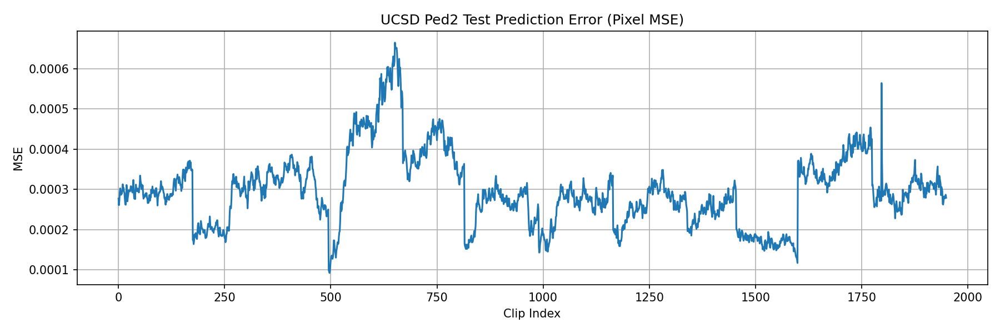

<h3>Detection Performance (AUC / ROC Curve)</h3>

Receiver Operating Characteristic (ROC) curve computed using MSE-based anomaly scores and aligned ground-truth labels.

<h4>3) ROC / AUC Curve (Pixel MSE)</h4>
<ul>
  <li>Attention AUC (MSE): <b>0.738</b></li>
</ul>
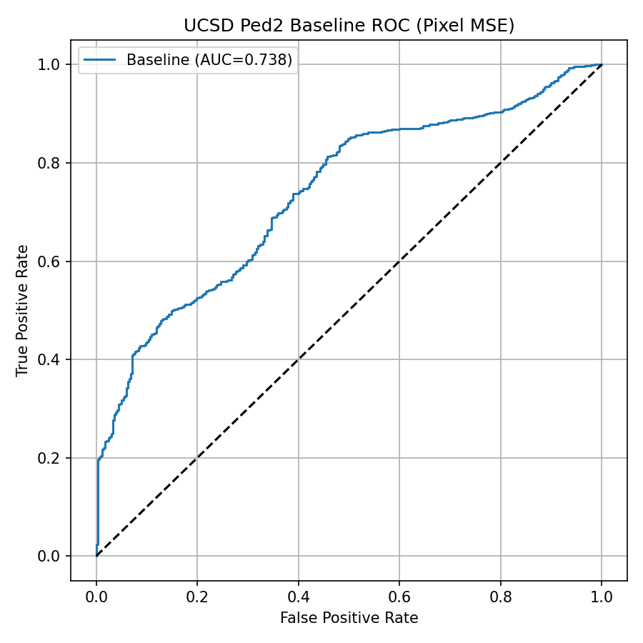

<h3>Qualitative Results (GT vs Predicted)</h3>

A qualitative comparison between the ground-truth frame and the predicted future frame.

  

    
<b>Ground Truth Frame</b>

    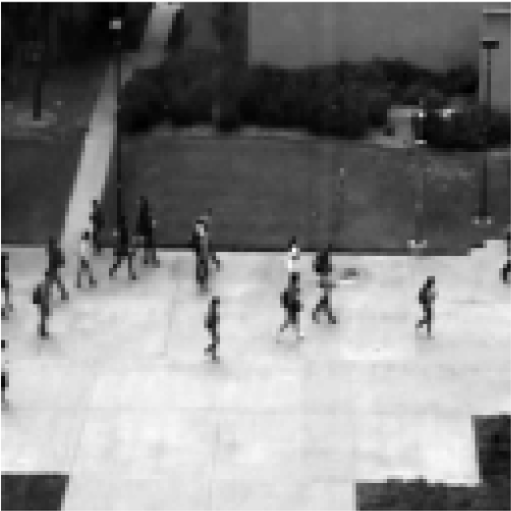
  

  

    
<b>Predicted Frame</b>

    
  

<h3>Observations</h3>
<ul>
  <li>The baseline model learns normal scene dynamics and produces low MSE on normal segments.</li>
  <li>Predicted frames tend to be slightly blurred, consistent with prediction-based methods.</li>
  <li>MSE spikes align with abnormal events, supporting the validity of prediction-error scoring.</li>
  <li>ROC curve indicates measurable separability between normal and abnormal frames using pixel-level error alone.</li>
</ul>

<h3>Limitations Identified</h3>
<ul>
  <li>All spatial regions are treated equally; the model lacks a mechanism to prioritize suspicious regions.</li>
  <li>Subtle/localized anomalies may not generate strong pixel-error spikes.</li>
  <li>Pixel-level MSE is sensitive to illumination changes and background motion, which can cause false alarms.</li>
</ul>

<h3>Conclusion of Work 1</h3>

This experiment confirms that the baseline future-frame prediction framework is functioning correctly
and can detect anomalies using MSE-based prediction error and AUC evaluation. The limitations motivate
introducing spatio-temporal attention in the next stage to improve focus and robustness.

<h2>Work 2: Attention-Enhanced Future Frame Prediction (UCSD Ped2)</h2>

<h3>Objective</h3>

The objective of this experiment is to evaluate whether incorporating a spatio-temporal attention mechanism
into a future-frame prediction model improves anomaly detection performance. The same attention model is
evaluated under two scoring strategies: (A) Pixel-level MSE only and (B) Combined Pixel + Feature error.

<h3>Model Architecture (Common)</h3>
<ul>
  <li><b>Encoder:</b> Simple CNN (3 conv layers, stride=2)</li>
  <li><b>Temporal Model:</b> ConvLSTM</li>
  <li><b>Attention:</b> Spatio-Temporal Attention after ConvLSTM</li>
  <li><b>Decoder:</b> Transposed CNN to predict the next frame</li>
</ul>

<pre>
Input Frames (5)
   ↓
CNN Encoder
   ↓
ConvLSTM
   ↓
Spatio-Temporal Attention
   ↓
Decoder
   ↓
Predicted Future Frame
</pre>

<h3>Training Summary</h3>
<ul>
  <li><b>Dataset:</b> UCSD Ped2 (normal training videos only)</li>
  <li><b>Sequence Length:</b> 5</li>
  <li><b>Image Size:</b> 128 × 128 (grayscale)</li>
  <li><b>Loss Function:</b> MSE</li>
  <li><b>Epochs:</b> 50</li>
</ul>

<pre>
Epoch 50 Avg Loss: 0.000197
</pre>

<h3>Work 2A: Attention + Pixel Error (MSE-based)</h3>

<h4>1) Qualitative Result (GT vs Predicted)</h4>

  

    
<b>Ground Truth Frame</b>

    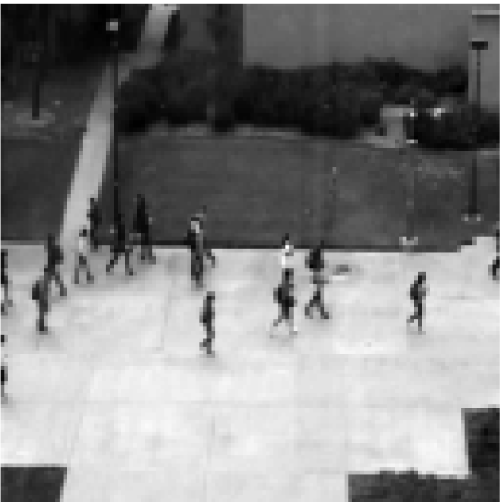
  

  

    
<b>Predicted Frame (Attention)</b>

    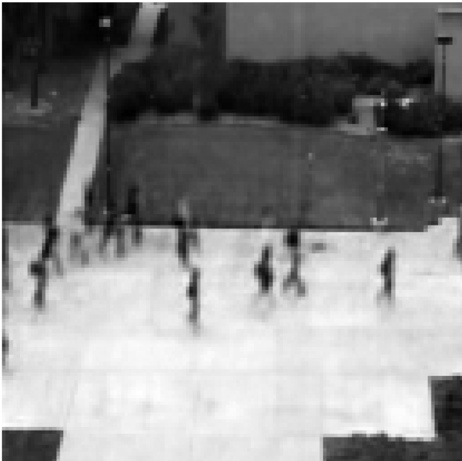
  

<h4>2) MSE Error Curve</h4>
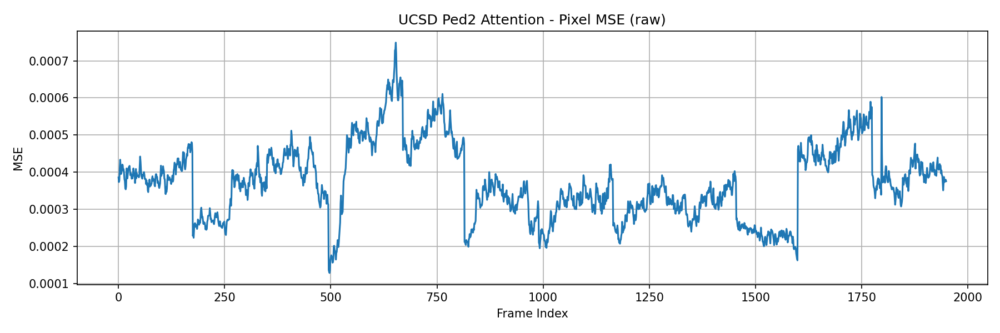

<h4>3) ROC / AUC Curve (Pixel MSE)</h4>
<ul>
  <li>Attention AUC (MSE): <b>0.692</b></li>
</ul>
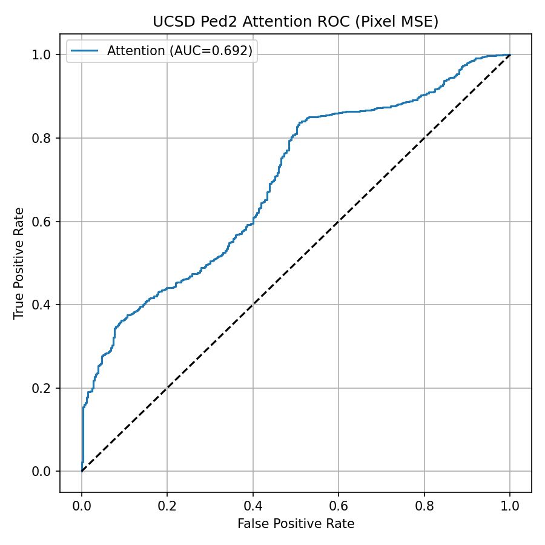

<h4>Comparison with Baseline</h4>
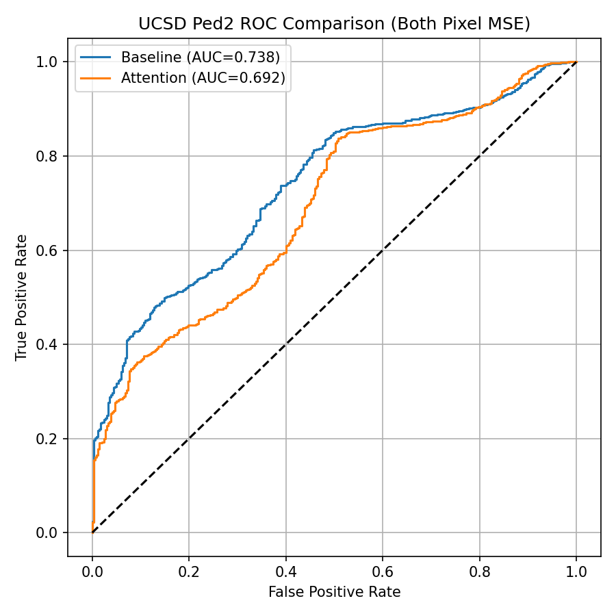

<h3>Work 2B: Attention + Pixel + Feature Error (Combined Scoring)</h3>
<h3>Objective</h3>

To overcome the limitations of pixel-level MSE, feature-level discrepancy is
introduced as an additional anomaly score while keeping the model architecture
unchanged.

<h3>Method</h3>

Deep features are extracted from the shared CNN encoder for both predicted and
ground-truth frames. The final anomaly score is computed as a weighted
combination of pixel-level and feature-level errors.

<pre>
Final Anomaly Score = α · Pixel MSE + β · Feature-Level Error
</pre>
<h4>1) Qualitative Result (GT vs Predicted)</h4>

  

    
<b>Ground Truth Frame</b>

    
  

  

    
<b>Predicted Frame (Attention)</b>

    
  

<h4>2) Pixel + Feature Error Curve</h4>
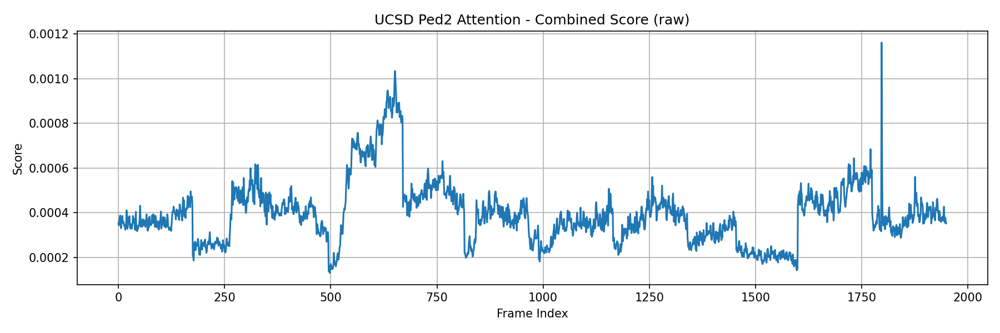

<h4>3) ROC / AUC Curve (Pixel + Feature)</h4>
<ul>
  <li>Attention + Feature AUC: <b>0.775</b></li>
</ul>
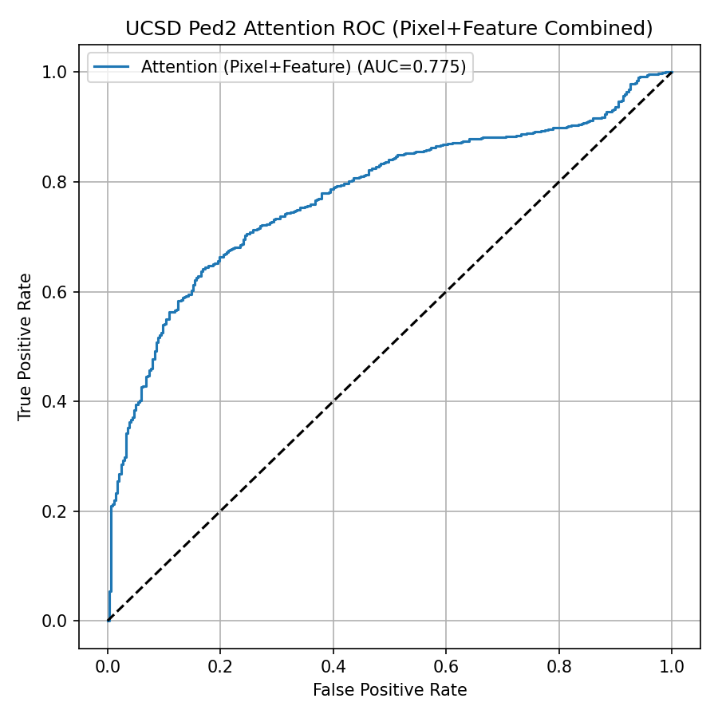
<h4>Comparison with Baseline</h4>
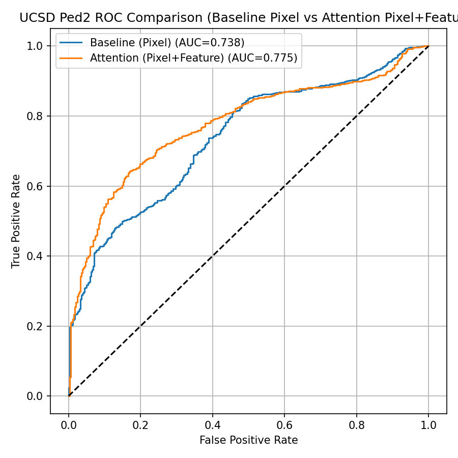

<h3>Observations</h3>
<ul>
  <li>Feature-level error provides a smoother and more discriminative anomaly score.</li>
  <li>Subtle motion anomalies are detected more effectively.</li>
  <li>The combination of attention and feature-level scoring yields the best performance.</li>
  <li>AUC improves by <b>+3.7%</b> over the baseline model.</li>
</ul>

<h3>Conclusion from Work 2</h3>

Attention improves feature representations, but feature-level anomaly scoring is
essential to fully exploit this improvement. The proposed framework achieves
significant performance gains on UCSD Ped2 under a proper evaluation protocol.

<h3>Quantitative Results of ucsd ped2 dataset</h3>
<ul>
  <li>Baseline + MSE AUC: <b>0.738</b></li>
  <li>Attention + MSE AUC: <b>0.692</b></li>
  <li>Attention + Feature-Level Error AUC: <b>0.775</b></li>
</ul>

<h2>Work 3: Anomaly Localization with Red Bounding Boxes (Error Heatmap → Connected Components)</h2>

<h3>Objective</h3>

The objective of this work is to extend frame-level anomaly scoring into a practical
localization output by highlighting regions responsible for abnormal behavior.
This is done by converting the prediction error into a spatial heatmap and drawing
red bounding boxes around the most relevant high-error regions.

<h3>Where This Fits in the Pipeline</h3>
<ul>
  <li>The model still performs future-frame prediction using the attention-enhanced architecture.</li>
  <li>Anomaly scoring still uses a weighted combination of pixel-level and feature-level errors.</li>
  <li>Localization is performed as a post-processing step using the absolute pixel error map.</li>
</ul>

<pre>
Input Frames (5)
   ↓
CNN Encoder
   ↓
ConvLSTM
   ↓
Spatio-Temporal Attention
   ↓
Decoder
   ↓
Predicted Future Frame
   ↓
Absolute Error Map |pred - gt|
   ↓
Normalize → Threshold → Connected Components
   ↓
Red Bounding Box Overlay + Video Export
</pre>

<h3>Localization Method</h3>

For each predicted frame, an error heatmap is computed using the absolute pixel difference
between the predicted frame and the actual frame. The heatmap is normalized to [0,1], then
thresholded to form a binary mask. Connected components are extracted from this mask and
the largest component(s) are converted into bounding boxes. These boxes are drawn in red
on the ground-truth frame and exported as an MP4 video for each test sequence.

<h3>Key Implementation Choices</h3>
<ul>
  <li><b>Error heatmap:</b> |pred − gt| (absolute pixel error), normalized to [0,1]</li>
  <li><b>Thresholding:</b> fixed threshold in normalized space (thr)</li>
  <li><b>Region extraction:</b> Connected Components (more robust than contour extraction for thin/noisy masks)</li>
  <li><b>Filtering:</b> minimum component area (min_area) to suppress small noisy regions</li>
  <li><b>Selection:</b> keep only the top-k largest component(s) (keep_top_k)</li>
  <li><b>Overlay:</b> red rectangle drawn on the ground-truth frame</li>
  <li><b>Output:</b> per-video MP4 export for qualitative inspection</li>
</ul>

<h3>Parameters Used (Current Settings)</h3>
<ul>
  <li><b>Sequence Length:</b> 5</li>
  <li><b>Video FPS:</b> 10</li>
  <li><b>Heatmap threshold (thr):</b> 0.35</li>
  <li><b>Minimum region area (min_area):</b> 20</li>
  <li><b>Top-k regions (keep_top_k):</b> 1</li>
  <li><b>Score weights:</b> α = 0.3, β = 0.7 (used for anomaly scoring; localization uses pixel error heatmap)</li>
  <li><b>Export folder:</b> boxed_videos/</li>
</ul>

<h3>Qualitative Output (Red-Box Video Exports)</h3>

This work produces per-test-sequence videos with red bounding boxes overlaid on each frame.
The bounding boxes are generated from the normalized absolute prediction error heatmap using
thresholding and connected components. The videos below provide qualitative evidence of where
the model localizes abnormality over time.

<h4>Sample 1: Test004</h4>

<a href="scripts/boxed_videos/Test004.mp4">Download / View Test004 Video (MP4)</a>

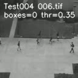

<h4>Sample 2: Test006</h4>

<a href="scripts/boxed_videos/Test006.mp4">Download / View Test006 Video (MP4)</a>

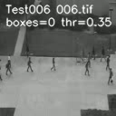

<h3>Observations</h3>
<ul>
  <li>The connected-components based approach provides stable region proposals even when the mask is sparse or fragmented.</li>
  <li>Using <b>keep_top_k = 1</b> reduces clutter and highlights the most dominant error region per frame.</li>
  <li>Localization is sensitive to the threshold <b>thr</b>: lower values increase recall but may include background noise; higher values may miss subtle anomalies.</li>
  <li>Small noisy regions are reduced using <b>min_area</b>, improving box consistency across consecutive frames.</li>
  <li>Overall, this step improves interpretability by showing <i>where</i> the model indicates abnormality, not just <i>whether</i> abnormality exists.</li>
</ul>

<h3>Limitations Identified</h3>
<ul>
  <li>The localization heatmap is derived from pixel error, so it may highlight regions affected by illumination change or motion blur.</li>
  <li>Bounding boxes may be coarse when the anomalous region is diffuse or when multiple regions are abnormal in the same frame.</li>
  <li>Current localization is purely error-driven and does not explicitly incorporate object boundaries; boxes may not tightly fit the anomalous object.</li>
</ul>

<h3>Conclusion of Work 3</h3>

This work adds interpretability to the anomaly detection pipeline by exporting red-box
localized videos. The approach demonstrates that prediction error maps can be used to
highlight candidate anomalous regions across time, enabling qualitative validation and
supporting downstream monitoring or alerting use cases.

<h2>Avenue Dataset</h2>

<h4>Baseline</h4>
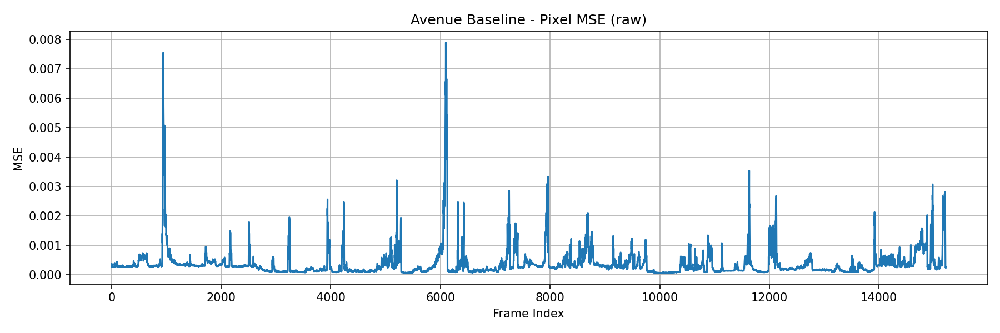

<h4>3) ROC / AUC Curve (Pixel MSE)</h4>
<ul>
  <li>Attention AUC (MSE): <b>0.864</b></li>
</ul>
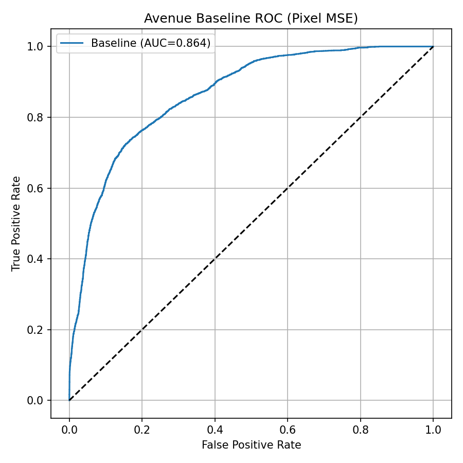

<h3>Qualitative Results (GT vs Predicted)</h3>

A qualitative comparison between the ground-truth frame and the predicted future frame.

  

    
<b>Ground Truth Frame </b>& <b>Predicted Frame</b>

    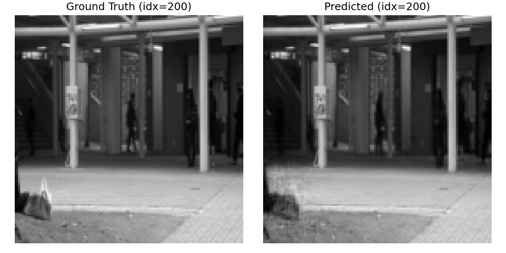
  

<h3>Work 2A: Attention + Pixel Error (MSE-based)</h3>

<h4>1) Qualitative Result (GT vs Predicted)</h4>

  

    
<b>Ground Truth Frame</b> & <b>Predicted Frame (Attention)</b>

    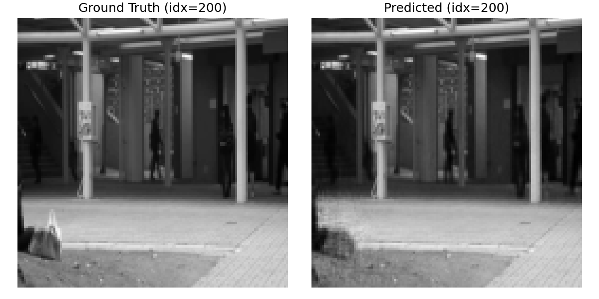
  

<h4>2) MSE Error Curve</h4>
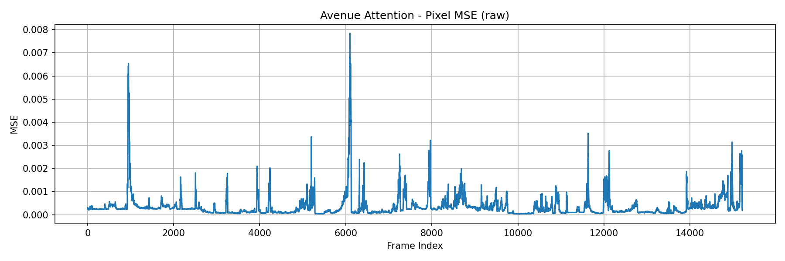

<h4>3) ROC / AUC Curve (Pixel MSE)</h4>
<ul>
  <li>Attention AUC (MSE): <b>0.872</b></li>
</ul>
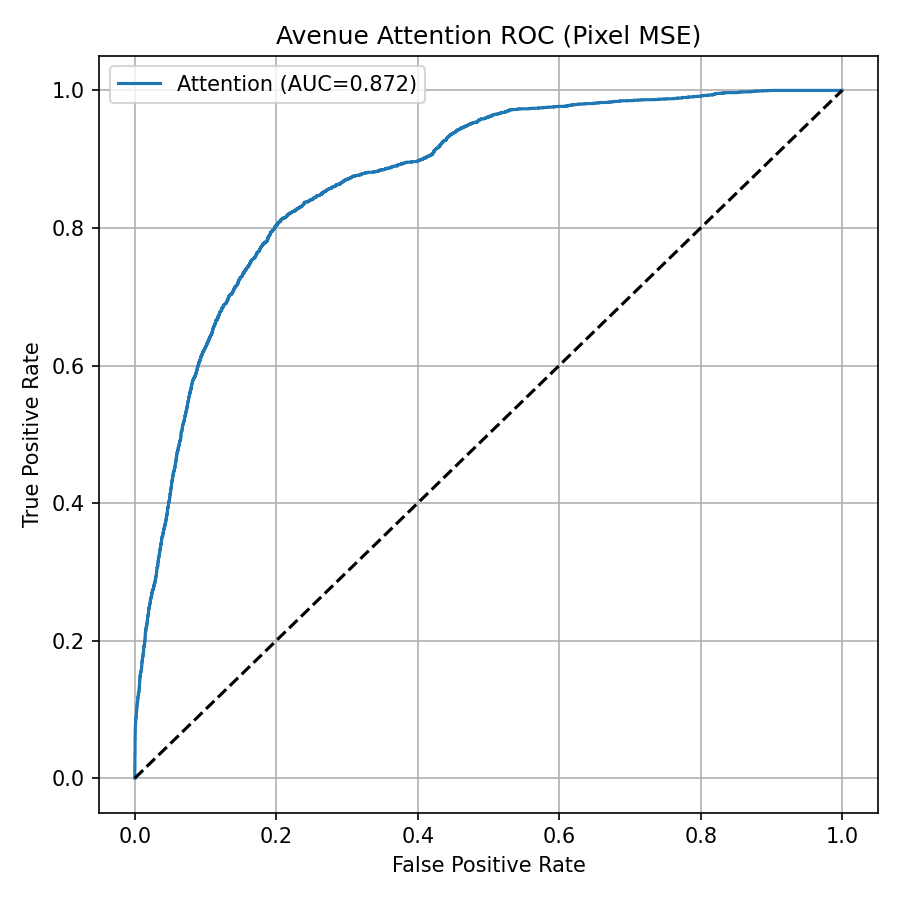

<h4>Comparison with Baseline</h4>
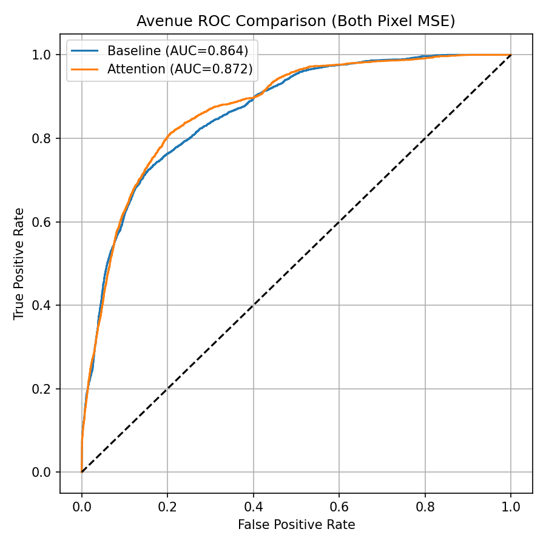

<h3>Work 2B: Attention + Pixel + Feature Error (Combined Scoring)</h3>
<h3>Objective</h3>

To overcome the limitations of pixel-level MSE, feature-level discrepancy is
introduced as an additional anomaly score while keeping the model architecture
unchanged.

<h3>Method</h3>

Deep features are extracted from the shared CNN encoder for both predicted and
ground-truth frames. The final anomaly score is computed as a weighted
combination of pixel-level and feature-level errors.

<pre>
Final Anomaly Score = α · Pixel MSE + β · Feature-Level Error
</pre>
<h4>1) Qualitative Result (GT vs Predicted)</h4>

  

    
<b>Ground Truth Frame</b> & <b>Predicted Frame (Attention)</b>

    
  

<h4>2) Pixel + Feature Error Curve</h4>
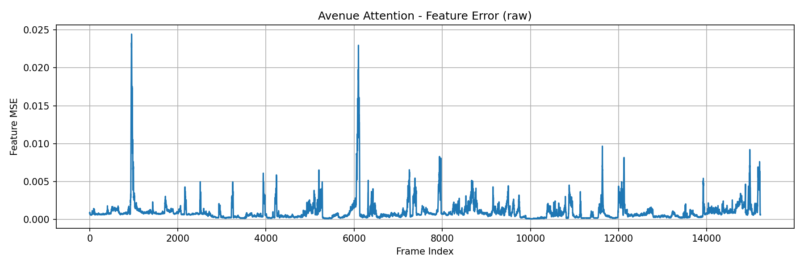

<h4>3) ROC / AUC Curve (Pixel + Feature)</h4>
<ul>
  <li>Attention + Feature AUC: <b>0.873</b></li>
</ul>
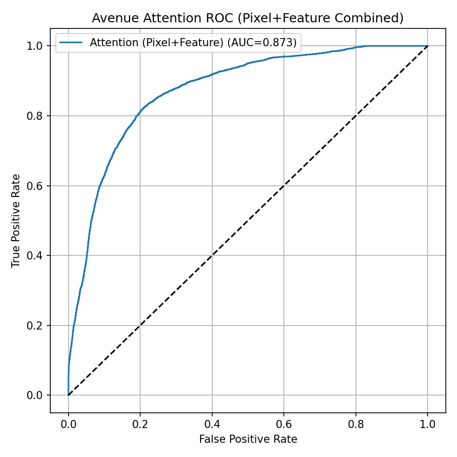
<h4>Comparison with Baseline</h4>
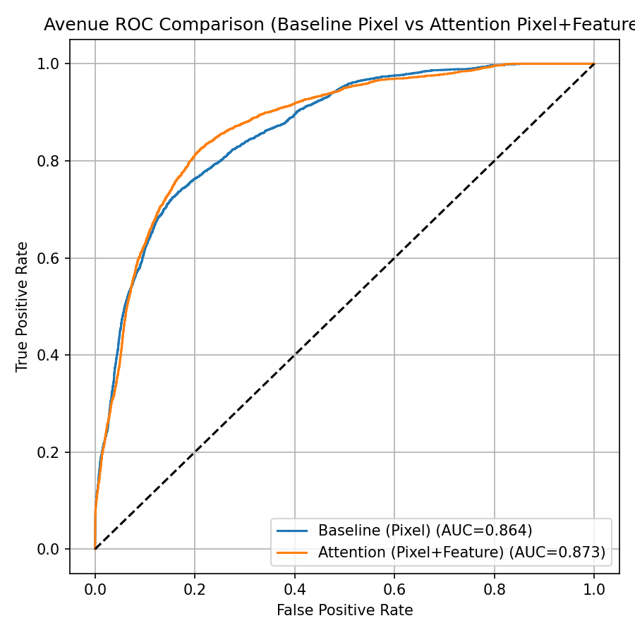

<h3>Qualitative Output (Red-Box Video Exports)</h3>

This work produces per-test-sequence videos with red bounding boxes overlaid on each frame.
The bounding boxes are generated from the normalized absolute prediction error heatmap using
thresholding and connected components. The videos below provide qualitative evidence of where
the model localizes abnormality over time.

<h4>Sample 1: Test004</h4>

<a href="scripts/boxed_videos_avenue_attention/08.mp4">Download / View 08 Video (MP4)</a>

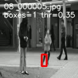
